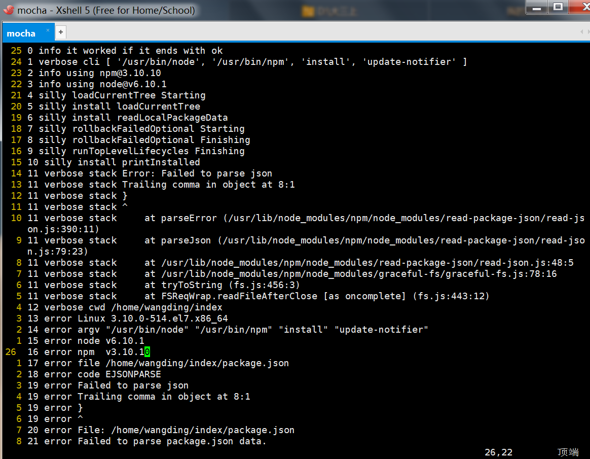
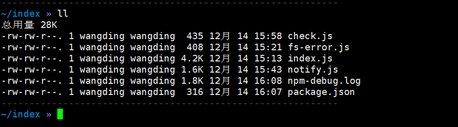
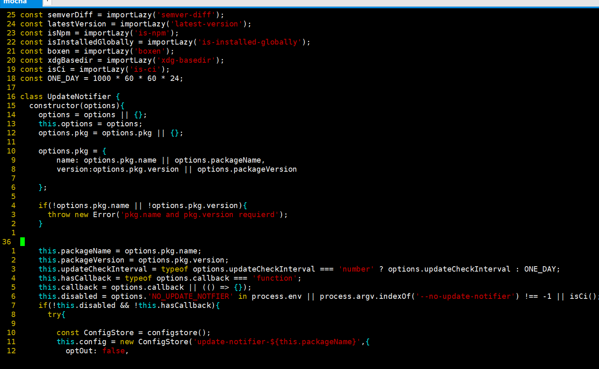
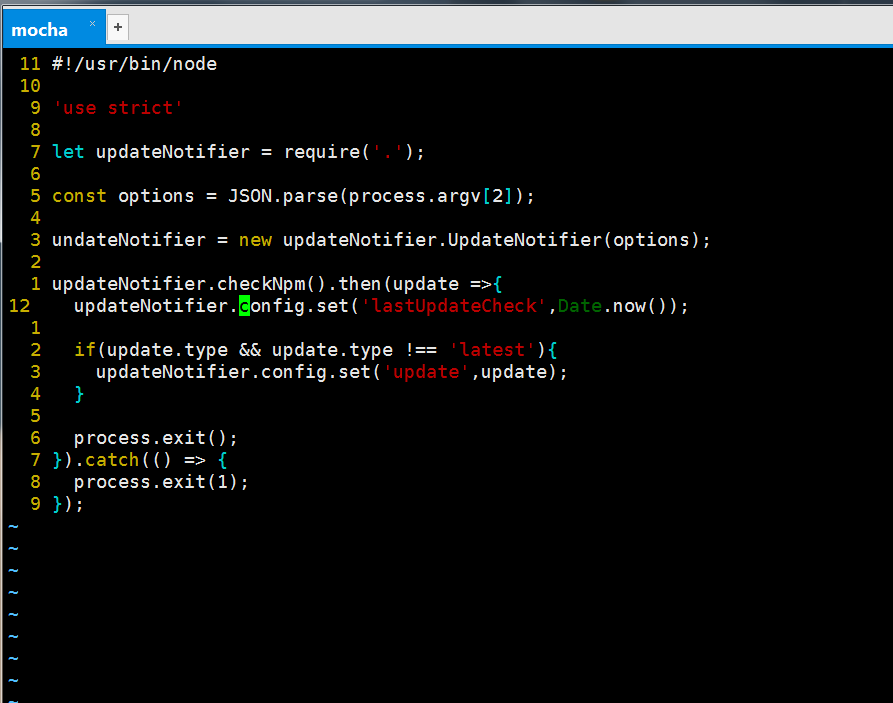

# -update-notifier-
# 更新通知项目的解析

 
##  1.index.js文件中引用的一些npm
### spawn  
####  spawn.js旨在使用Node.js进行多进程编程。该库允许您在新的Node.js实例中产生任何函数。你得到一个EventEmitter，你可以使用它来与产生的工作者进行交流。
### path  
#### 这是发布到NPM注册中心的NodeJS“路径”模块的精确副本。文档
### format  
#### npm安装格式
### import-lazy
#### 传递一个自定义的导入函数
### configstore  
####  创建一个具有唯一ID的Configstore实例
###   chalk  
####  粉笔模块
- 富有表现力的API
- 高性能
- 能够嵌套样式
- 256 / Truecolor颜色支持
- 自动检测颜色支持
- 不扩展 String.prototype
### semver-diff
#### 获得两个DIFF类型版本：0.0.1 0.0.2→patchemverDiff（versionA，versionB），返回两个semver版本之间的差异类型，或者null如果它们是相同的，或者第二个比第一个更低。
### latest-version
#### 获取最新版本的NPM软件包
### is-npm
####  检测代码是否作为NPM脚本运行
### is-installed- global
####  检查您的软件包是否全球安装，如果您的CLI在全局和本地安装时需要不同的行为，可能会很有用
### boxen
####  在终端中创建框(创建边框)
### xdg-basedir
#### 获取XDG基本目录路径，属性.data，.config，.cache，.runtime将返回null在，无论是XDG环境变量没有设置常见的情况和用户的主目录无法找到
## 2.index文件中的函数
### constructor(options){}函数
#### 函数功能：1.用户第一次运行应用程序时，它将检查更新，即使更新可用，它也会在updateCheckInterval通知用户之前等待指定
```js
constructor(options) {
		//设置options对象是options对象或者空对象
		options = options || {};
		//这个option对象等于option对象
		this.options = options;
		//option中的pkg对象（将Node.js项目打包成一个可执行文件）等于options.pkg或者空对象
		options.pkg = options.pkg || {};

		// Reduce pkg to the essential keys. with fallback to deprecated options
		//将pkg减少到必要的键，回退到不推荐选项
		// TODO: Remove deprecated options at some point far into the future
		//TODO: 在将来的某个时候删除弃用的选项
		
		//定义options.pkg对象的名字、版本
		options.pkg = {
			name: options.pkg.name || options.packageName,
			version: options.pkg.version || options.packageVersion
		};
		//如果没有找到options.pkg对象的名字或者版本信息的话，将跑出一个新的错误：“需要'pkg.name 和 pkg.version”
		if (!options.pkg.name || !options.pkg.version) {
			throw new Error('pkg.name and pkg.version required');
		}
		//如果找到了，定义构造函数中的packageName为项目包（options.pkg.name）的名字，定义packageVersion为项目包

https://www.baidu.com/?tn=62004195_2_oem_dg（options.pkg.version）的版本
		this.packageName = options.pkg.name;
		this.packageVersion = options.pkg.version;
		//设置这里的更新检查区间为等号后面三目运算符得出的结果（判断options.updateCheckInterval的数据类型是否为‘number’ture则options.updateCheckInterval，false则ONE_DAY）
		this.updateCheckInterval = typeof options.updateCheckInterval === 'number' ? options.updateCheckInterval : 

ONE_DAY;	//设置这里的回调函数为 ：是否options的回调全等于function
		this.hasCallback = typeof options.callback === 'function';
		//设置这里的callback对象为options.callback对象或者是封装一个不包含任何参数的方法
		this.callback = options.callback || (() => {});
		//设置disabled对象为一个字符串‘NO_UPDATE_NOTIFIER’（ process.env：会将属性值转换成字符串）或者返回--no-update-notifier的位置不等于-1，或者为isci()函数
		this.disabled = 'NO_UPDATE_NOTIFIER' in process.env ||
			process.argv.indexOf('--no-update-notifier') !== -1 ||
			isCi();
		//如果非disabled且非hasCallback,抛出一个异常
		if (!this.disabled && !this.hasCallback) {
			try {
				//创建ConfigStore对象，调用configstore（）方法（configstore()：获取文件存储配置）
				const ConfigStore = configstore();
				//调用ConfigStore函数，参数为update-notifier-包的名字，函数内容为：输出false，设置时间间隔
				this.config = new ConfigStore(`update-notifier-${this.packageName}`, {
					optOut: false,
					// Init with the current time so the first check is only
					//用当前时间初始化，所以第一次检查是唯一的
					// after the set interval, so not to bother users right away
					//设定时间间隔，以免马上打扰到用户
					lastUpdateCheck: Date.now()
				});
			} catch (err) {
				// Expecting error code EACCES or EPERM
				//期待错误代码EACCES或EPERM
				const msg =
					chalk().yellow(format(' %s update check failed ', options.pkg.name)) +
					format('\n Try running with %s or get access ', chalk().cyan('sudo')) +
					'\n to the local update config store via \n' +
					chalk().cyan(format(' sudo chown -R $USER:$(id -gn $USER) %s ', xdgBasedir().config));
				//进程进行到控制台输出：错误信息
				process.on('exit', () => {
					console.error('\n' + boxen()(msg, {align: 'center'}));
				});
			}
		}
	}
```
### check() {}函数：检查更新
#### 函数功能：每当您启动更新通知程序并且它不在间隔阈值内时，它将在后台与npm异步检查可用更新，然后保留结果。下次启动通知程序时，结果将被加载到.update属性中。
``` js
check() {
		if (this.hasCallback) {
			this.checkNpm()
				.then(update => this.callback(null, update))
				.catch(err => this.callback(err));
			return;
		}

		if (
			!this.config ||
			this.config.get('optOut') ||
			this.disabled
		) {
			return;
		}
		//得到更新信息
		this.update = this.config.get('update');
		//如果得到了就删除
		if (this.update) {
			this.config.delete('update');
		}

		// Only check for updates on a set interval
		//只在设定的时间间隔内检查更新
		if (Date.now() - this.config.get('lastUpdateCheck') < this.updateCheckInterval) {
			return;
		}

		// Spawn a detached process, passing the options as an environment property
		//产生一个分离的进程，将选项作为环境属性传递
		spawn(process.execPath, [path.join(__dirname, 'check.js'), JSON.stringify(this.options)], {
			detached: true,
			stdio: 'ignore'
		}).unref();
	}
```
### checkNpm() {}函数
#### 函数功能：检查包管理器的函数（检测代码是否作为npm脚本运行），会返回最新版本、当前版本、版本类型、版本名字信息
```
checkNpm() {
		return latestVersion()(this.packageName).then(latestVersion => {
			//返回的信息：最新版本、当前版本、版本类型、版本名字
			return {
				latest: latestVersion,
				current: this.packageVersion,
				type: semverDiff()(this.packageVersion, latestVersion) || 'latest',
				name: this.packageName
			};
		});
	}
```
###  notify(){}函数
#### 函数功能：通知函数，参数为opts，作用是在一个通知框内通知更新，内容包括：新版本的一些信息
```
notify(opts) {
		if (!process.stdout.isTTY || isNpm() || !this.update) {
			return this;
		}

		opts = Object.assign({isGlobal: isInstalledGlobally()}, opts);

		opts.message = opts.message || 'Update available ' + chalk().dim(this.update.current) + chalk().reset(' → ') +
			chalk().green(this.update.latest) + ' \nRun ' + chalk().cyan('npm i ' + (opts.isGlobal ? '-g ' : '') + 

this.packageName) + ' to update';
		//创建边框通知栏
		opts.boxenOpts = opts.boxenOpts || {
			padding: 1,
			margin: 1,
			align: 'center',
			borderColor: 'yellow',
			borderStyle: 'round'
		};
		//创建messag对象，为通知框里的版本信息等
		const message = '\n' + boxen()(opts.message, opts.boxenOpts);
		if (opts.defer === false) {
			console.error(message);
		} else {
			process.on('exit', () => {
				console.error(message);
			});

			process.on('SIGINT', () => {
				console.error('');
				process.exit();
			});
		}
		return this;
	}
}
```
## 测试截图




## 遇到的问题
### 1.var：定义全局变量和局部变量，声明在for循环中的变量，跳出for循环同样可以使用。附：let在ECMAScript6标准中,一个重要的概念就是"JavaScript严格模式",需要在最前面加上"use strict";let注意点:let拥有块级作用域,一个{}就是一个作用域，也就是let声明块级变量，即局部变量；let在其作用域下面不存在变量提升；let在其作用域中不能被重复声明(函数作用域和块级作用域)。let的块级作用域注意：以下代码都在严格模式下执行的，必须声明'use strict';后才能使用let声明变量否则浏览并不能显示结果。const用来声明常量，一旦声明，其值就不可以更改，而且必须初始化。 const的作用域与let相同，只在声明所在的块级作用域内有效，并且也是和let一样不可以重复进行声明。const是常数变量，即一般在require一个模块的时候用或者定义一些全局常量，一旦定义，无法更改，无法重复赋值。
### 2.() => {}
#### ()=>{代码}这个表达式，最前面的小括号内()是委托使用的参数，大括号{}内是委托方法的具体实现，现在小括号内容为空，表示委托方法的参数为空，也就是封转一个不包含任何参数的方法。换成一般的委托定义就是：delegate void CommonDelegate();而且由于匿名函数是不具备类型的，因此还需要进行类型强转，所以需要在前面加上(Action)这样的转换，表示将匿名方法转换成标注的委托类型。Action是.NET自定义的委托，表示一个不接受任何参数的委托方法。综上所述，完整的写法应该是：(Action)(delegate(){// 处理代码;})以上是匿名函数的写法，.NET2.0可以支持。如果连匿名函数也不用，那就把delegate(){}这一段换成普通委托定义就行了，例如：Action action = new Action(Method);
 
