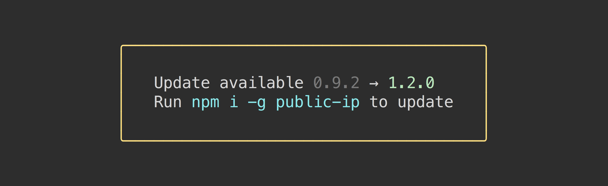

# 项目名称：更新通知
> 更新您的CLI应用程序的通知



以一种非侵入性的方式通知用户您的更新包。

### 内容
 
- [安装](#安装)
- [使用](#使用)
- [如何工作](#如何工作)
- [API](#api)
- [关于](#关于)
- [用户](#用户)


## 1.安装
 
```
$ npm install update-notifier
```


## 2.用法
 
### 简单安装
```js
const updateNotifier = require('update-notifier');
const pkg = require('./package.json');

updateNotifier({pkg}).notify();
```

### 复杂安装
```js
const updateNotifier = require('update-notifier');
const pkg = require('./package.json');

//检查可用的更新并返回实例
const notifier = updateNotifier({pkg});

//使用内置方便方法通知
notifier.notify();

// “Notificfier.update”包含一些有关更新的有用信息
/*
{
	latest: '1.0.1',
	current: '1.0.0',
	type: 'patch', // Possible values: latest, major, minor, patch, prerelease, build
	name: 'pageres'
}
*/
```

### 3.选项和自定义消息

```js
const notifier = updateNotifier({
	pkg,
	updateCheckInterval: 1000 * 60 * 60 * 24 * 7 // 1 week
});

if (notifier.update) {
	console.log(`Update available: ${notifier.update.latest}`);
}
```


## 4.如何使用
 
每当您启动更新通知程序并且它不在间隔阈值内时，它将在后台与npm异步检查可用更新，然后保留结果。下次启动通知程序时，结果将被加载到.update属性中。这可以防止对包的启动性能产生任何影响。更新检查是在一个没有启动的子进程中完成的。这意味着如果您打电话process.exit，支票将仍然在自己的过程中执行。

用户第一次运行应用程序时，它将检查更新，即使更新可用，它也会updateCheckInterval在通知用户之前等待指定。这样做不会让用户恼火，但是如果你正在测试它是否有效，可能会让你感到惊讶。检查出example.js快速测试出来update-notifier，看看如何测试，它的作品在您的应用程序。

## API

### notifier = updateNotifier(options)

检查是否有可用的更新。接受下面定义的选项。返回带有.update属性的实例有可用更新，否则返回undefined

### 选项
 
#### pkg
 
类型: `Object`

##### name
 
*必须*<br>
类型: `string`

##### version

*必须*<br>
类型: `string`

#### updateCheckInterval

类型: `number`<br>
默认: `1000 * 60 * 60 * 24` *(1天)*
 
多久检查一次更新
 
#### callback(error, update)
 
类型: `Function`

通过回调将直接检查更新并立即报告。不推荐，因为你不会得到解释的好处How。update 相当于 notifier.update。

### notifier.notify([选项])

便捷方法显示通知消息。（见截图）

只有在有更新的情况下才会通知，进程是TTY。(https://nodejs.org/api/process.html#process_tty_terminals_and_process_stdout).

#### options
 
类型: `Object`

##### defer
 
类型: `boolean`<br>
默认: `true`

在进程退出后推迟显示通知

##### message
 
类型: `string`<br>
默认: 见上面的截图(https://github.com/weixiaoming120/-update-notifier-/edit/master/intro.md)

当更新可用时将显示的消息。

##### isGlobal

类型: `boolean`<br>
默认: `true`

将-g参数包含在默认消息的npm i建议中。如果您的CLI软件包可以作为另一个项目的依赖项安装，并且不想推荐全局安装，则可能需要更改此设置。如果你自己提供这个选项，这个选项将被忽略message（见上）。

##### boxenOpts

类型: `Object`<br>
默认: `{padding: 1, margin: 1, align: 'center', borderColor: 'yellow', borderStyle: 'round'}` *(查看截图)*

将传递给的选项对象boxen.

### 用户设置

您的模块的用户可以通过将optOut属性更改为truein 来退出更新通知程序~/.config/configstore/update-notifier-[your-module-name].json。路径可用notifier.config.path。

用户也可以通过设置 NO_UPDATE_NOTIFIER任意值的环境变量或--no-update-notifier每次运行使用标志来选择退出。

该检查也会在CI上自动跳过。
## 关于
 
这个模块的想法来自于希望将浏览器更新策略应用到CLI工具，其中每个人都始终在最新版本。我们首先尝试了自动更新，我们发现它并不流行。这是该想法的第二次迭代，但仅限于更新通知。

## 用户

有一些项目使用它：

- [npm](https://github.com/npm/npm) -  JavaScript的包管理器
- [Yeoman](http://yeoman.io) -  现代webapps的现代工作流程
- [AVA](https://ava.li) -  简单的并发测试运行器
- [XO](https://github.com/sindresorhus/xo) -  JavaScript的幸福风格棉绒
- [Pageres](https://github.com/sindresorhus/pageres) - 捕捉网站截图
- [Node GH](http://nodegh.io) -  GitHub命令行工具

还有1600多个...(https://www.npmjs.org/browse/depended/update-notifier)
